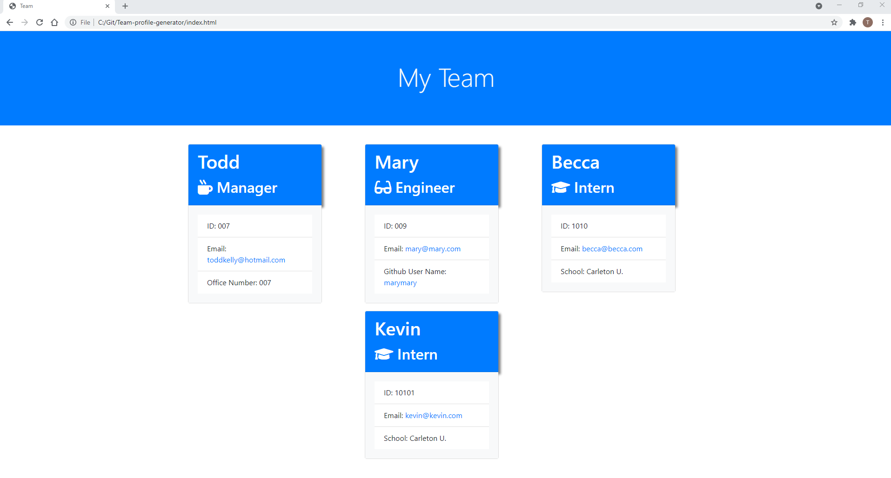

# Team-Profile Generator

## Description

This is a Node.js command-line application that takes in information about employees on a software engineering team, then generates an HTML webpage that displays summaries for each person.

GIVEN a command-line application that accepts user input
When prompted for team members and their information then an HTML file is generated that displays a formatted team roster based on user input.
When clicked on an email address in the HTML then default email program opens and populates the field of the email with the address.
When clicked on the GitHub username then that GitHub profile opens in a new tab.
When the application is started then the user is prompted to enter the team manager’s name, employee ID, email address, and office number.
When the team manager’s name is entered with employee ID, email address, and office number then I am presented with a menu with the option to add an engineer or an intern or to finish building my team.
When the engineer option is selected then the user prompted to enter the engineer’s name, ID, email, and GitHub username, and I am taken back to the menu.
When the intern option is selected then the user am prompted to enter the intern’s name, ID, email, and school, and the user is taken back to the menu.
When the user decides to finish building their team they exit the application, and the HTML is generated.

Here is a demo of the application:

Here is a screenshot of the HTML page generated by the demo:

